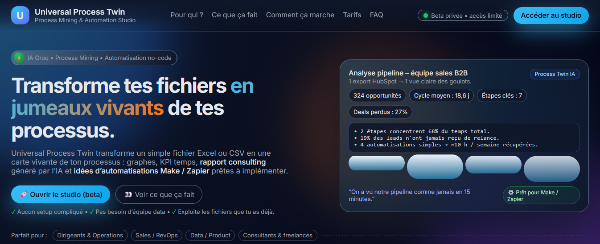
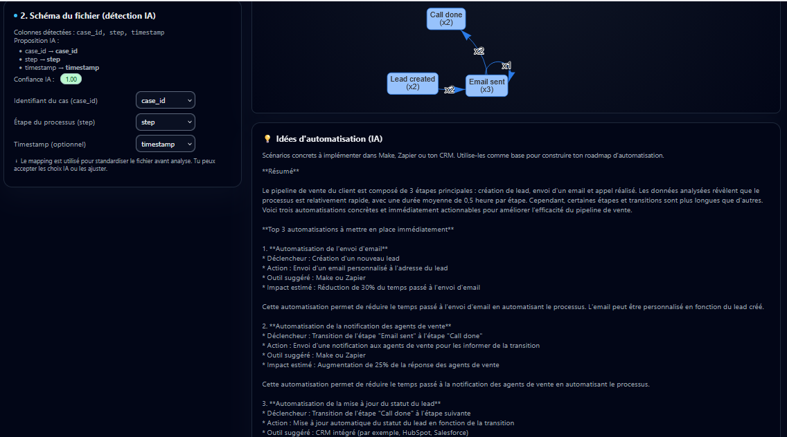

  

<h1 align="center">🧠 Universal Process Twin</h1>
<h3 align="center">Analyse de processus automatisée • IA • Process Mining • KPI • Automatisations • Dashboard SaaS</h3>

  
  

---

# 📌 Présentation

Universal Process Twin est un **studio d'analyse de processus avec IA**, permettant d'analyser automatiquement n’importe quel workflow métier à partir d’un simple fichier CSV ou Excel.

Il combine :

- **Process Mining**
- **Data Engineering**
- **Analyse IA (Groq LLM)**
- **KPI avancés**
- **Suggestions d’automatisation (Make, Zapier, CRM…)**
- **Visualisation dynamique**
- **Export PDF**
- **Authentification & sauvegarde de projets**

Ce projet est conçu dans une logique **SaaS moderne**, avec un **frontend complet**, un **backend FastAPI**, une **IA intégrée**, et une **architecture propre et scalable**.

---

# ✨ Fonctionnalités

### 🧠 IA intégrée
- Détection automatique des colonnes (case_id, step, timestamp)
- Rapport IA structuré :
  - Résumé exécutif
  - Points forts
  - Risques & problèmes
  - Recommandations
  - Priorités d’action
- Idées d'automatisation (Make, Zapier, CRM, Notion…)

### 📊 Analyse du processus
- Détection d’étapes & transitions
- Graphe dynamique du workflow
- Fréquences des transitions
- Points d’entrée & sortie
- Vue simplifiée & détaillée

### ⏱ KPI (si timestamp présent)
- Cycle time global
- Durée moyenne par étape
- Transitions lentes / rapides
- Bottlenecks
- Tableau complet des métriques

### 🎨 Interface web complète
- Dashboard moderne
- Thème clair / sombre
- Navigation intuitive
- Sauvegarde locale des projets
- Export PDF complet

### 🔐 Authentification incluse
- Création de compte
- Login
- Token
- Session locale
- SQLite embarqué

---

# 📸 Aperçu du produit

## 🏠 Landing page

  

---

## 📊 Dashboard d'analyse

  

---

## 🔗 Graphe du processus

  

---

# 🧠 Stack technique

### 🔥 Backend
- Python 3
- FastAPI
- Pydantic
- Pandas
- SQLite
- python-dotenv
- Groq API (LLM)

### 🎨 Frontend
- HTML / CSS
- JavaScript (vanilla)
- vis-network (graph visualisation)
- jsPDF (génération PDF)
- LocalStorage

### 🏗 Architecture
- API REST
- Séparation logique propre
- Gestion des erreurs
- Authentification par token
- Mapping dynamique de colonnes

---

🧪 Cas d’usage

Analyse pipeline commercial

Support (tickets & temps de résolution)

Processus RH (candidatures)

Facturation / Paiement

Onboarding client

Logs logistiques

Flows internes d’entreprise

Audit consulting (livrer des PDF prêts à envoyer)

💼 Compétences démontrées

Data engineering (pandas)

Process Mining

Backend (FastAPI)

Frontend (JS/HTML/CSS)

IA appliquée (Groq API)

Prompt engineering

Architecture logicielle

Authentification

Génération PDF

Design UI/UX

Product building (mini SaaS)

🗺️ Roadmap

Dashboard temps réel

Multi-utilisateurs & organisations

JWT complet & refresh tokens

Connecteurs : HubSpot, Pipedrive, Notion, Airtable

Import multi-fichiers

Exports Excel enrichis

Mode consultant (marque blanche)

Déploiement SaaS (Render / Railway / Vercel)

Auto-détection avancée du timestamp

Recommandations d’automatisation basées sur données réelles

📜 Licence

Projet personnel.
Usage commercial → me contacter : alhousseynoundiaye8@gmail.com

⭐ Support

Si le projet t’inspire ou t’aide, laisse une ⭐ sur GitHub ❤️
